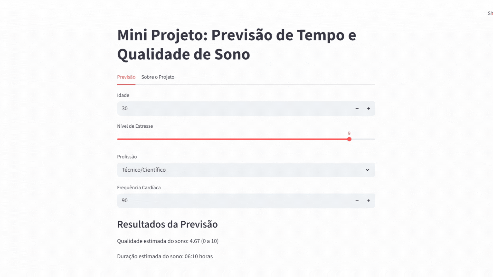

# Mini Projeto: Previsão de Qualidade e Duração do Sono



## Sobre o projeto:
Este projeto tem como objetivo estimar a qualidade do sono (no intervalo 0–10) e a duração do sono (em horas) a partir de variáveis simples como idade, nível de estresse, profissão e frequência cardíaca. Foi desenvolvido como exercício prático de machine learning, unindo a modelagem de dados com a criação de uma interface interativa. Os modelos de previsão foram treinados utilizando o Google Cloud.

---

## Tecnologias utilizadas
O projeto foi construído utilizando as seguintes tecnologias:
- Linguagem: Python 3.10+
- Web App: Streamlit
- Análise de dados: Pandas, Numpy
- Machine Learning: Scikit-learn, Joblib
- Visualização de dados: Matplotlib, Seaborn, Plotly Express

---

## Estrutura do projeto
O repositório contém os seguintes arquivos:
- app_sono.py: O código-fonte do projeto no Streamlit.
- modelo_quality.joblib: O modelo de aprendizado de máquina para prever a qualidade do sono.
- modelo_duration.joblib: O modelo de aprendizado de máquina para prever a duração do sono.
- Sleep_health_and_lifestyle_dataset.csv: O dataset original usado para treinar os modelos.
- requirements.txt: Lista as bibliotecas Python necessárias para executar o aplicativo.

---

## Como executar o projeto localmente
Para executar o projeto na sua máquina, siga os seguintes passos no seu prompt de comando:

0. Instale o Python (se ainda não tiver)
```bash
#No Windows, use
winget install -e --id Python.Python.3.10

#No Linux, use
sudo apt update
sudo apt install python3 python3-venv python3-pip -y

#No macOS, use
brew install python@3.10
```
  
1. Clone o repositório

```bash
git clone https://github.com/arthurlopes767/mini-projeto-previsao-sono.git
cd mini-projeto-previsao-sono
```

Se for utilizar em uma máquina sem o Git instalado, faça o download do ZIP do projeto e extraia em uma pasta qualquer. Depois, abra o terminal nessa pasta usando
```bash
cd C:\Users\NomeDoUtilizador\Pasta\Nome-da-Pasta-com-o-Projeto
```

2. Crie e ative um ambiente virtual

```bash
python -m venv venv

#No Linux e macOS, use
source venv/bin/activate

#No Windows, use
venv\Scripts\activate
```

3. Instale as dependências

```bash
pip install -r requirements.txt
```

5. Verifique se a sua versão do Python é superior ou igual a >= 3.10
```bash
python --version
```

6. Por fim, execute o aplicativo

```bash
streamlit run app_sono.py
```

---

## Autores
 
Arthur Luiz Lopes Araujo (https://www.linkedin.com/in/arthur-luiz-lopes-araujo-391aa3218/)

Gabriela Nogueira (https://www.linkedin.com/in/gabriela-nogueira-5a04a5351/utm_source=share&utm_campaign=share_via&utm_content=profile&utm_medium=android_app)

Gustavo Hideki Kato (https://www.linkedin.com/in/gustavo-hideki-kato-287187307/)

Isaque Yikang Chen

Luiz Gabriel Bocalão Costa (https://www.linkedin.com/in/luizgabrielcosta)


Com ajuda de: Lucas Fernandez Gallegov (https://www.linkedin.com/in/lucas-fernandez-gallego/)


